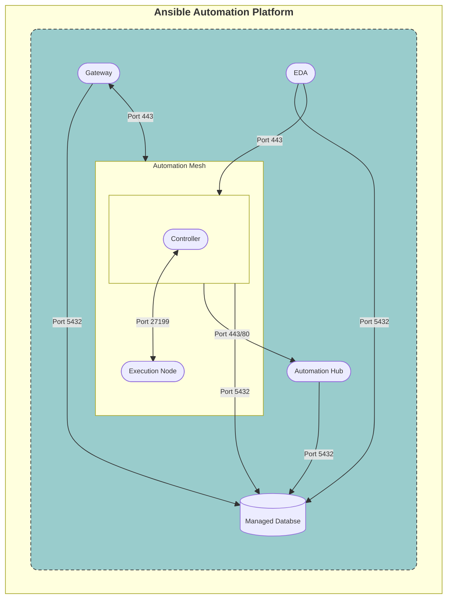

# CONT-A.ENV-A - Standard Containerized Deployment

## Containerized single VM deployment

## Topology



**_Legend:_**


## Description

The **AAP Components deployed inside a container** consists of the following:

| Component             | VM count |
| --------------------- | -------- |
| AAP Gateway           | 1        |
| Automation Controller | 1        |
| Automation Hub        | 1        |
| Event Driven Ansible  | 1        |
| Database              | 1        |

## Inventory

```
[automationcontroller]
automationcontroller-0 ansible_user=ec2-user ansible_python_interpreter="/usr/libexec/platform-python" ansible_host=<<replace with controller ip>>

[automationhub]
automationhub-0 ansible_user=ec2-user ansible_python_interpreter="/usr/libexec/platform-python" ansible_host=<<replace with hub ip>>

[automationedacontroller]
automationedacontroller-0 ansible_user=ec2-user ansible_python_interpreter="/usr/libexec/platform-python" ansible_host=<<replace with eda controller ip>> routable_hostname=automationedacontroller-0

[automationgateway]
automationgateway-0 ansible_user=ec2-user ansible_python_interpreter="/usr/libexec/platform-python" ansible_host=<<replace with gateway ip>> routable_hostname=automationgateway-0

[database]
database-0 ansible_user=ec2-user ansible_python_interpreter="/usr/libexec/platform-python" ansible_host=<<replace with db ip>> routable_hostname=database-0


[installer]
installer_machine ansible_connection=local ansible_python_interpreter="/usr/libexec/platform-python"


[all:vars]
controller_admin_password=<< Controller admin password >>
controller_pg_host=aio-0.testing.com
controller_pg_password=<< Controller pg password >>
eda_admin_password=<< eda admin password >>
eda_pg_host=aio-0.testing.com
eda_pg_password=<< eda pg password >>
eda_type=hybrid
hub_pg_host=aio-0.testing.com
hub_pg_port=5432
hub_pg_database=automationhub
hub_pg_username=automationhub
hub_pg_password=<< hub pg password >>
hub_admin_password=<< hub admin password >>
gateway_admin_password=<< gateway admin password >>
gateway_pg_host=aio-0.testing.com
gateway_pg_password=<< gateway pg password >>
postgresql_admin_password=<< postgresql admin password >>
controller_base_url=https://controller ip/
gateway_base_url=https://gateway ip/
hub_base_url=https://hub ip/
automationedacontroller_base_url=https://eda ip/
controller_local_resource_management=True
hub_local_resource_management=True
eda_local_resource_management=True
registry_auth=True
registry_url=brew.registry.redhat.io
registry_ns_aap=rh-osbs
registry_ns_rhel=rh-osbs
registry_tls_verify=True

[automationgateway:vars]
gateway_grpc_server_processes=20
gateway_grpc_server_max_threads_per_process=40
gateway_grpc_auth_service_timeout=120s

```
