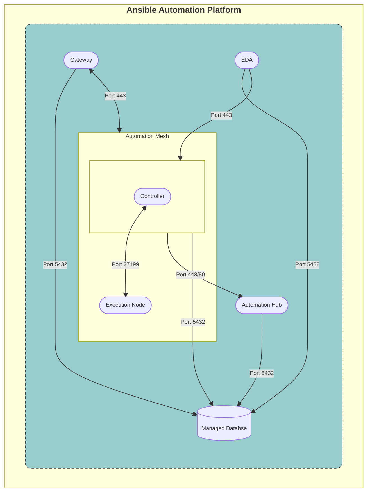
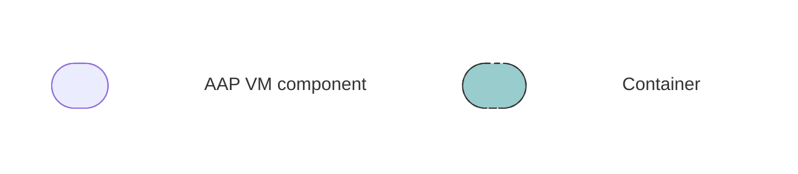

# CONT-A.ENV-A - Standard Containerized Deployment

## Containerized single VM deployment

## Topology

**_Legend:_**

## Description

The **AAP Components deployed inside a container** consists of the following:

| Component                | VM count |
| ---------------------    | -------- |
| AAP Gateway 2.5          | 1        |
| Automation Controller 2.4| 1        |
| Automation Hub 2.4       | 1        |
| Event Driven Ansible 2.5 | 1        |
| Database                 | 1        |
