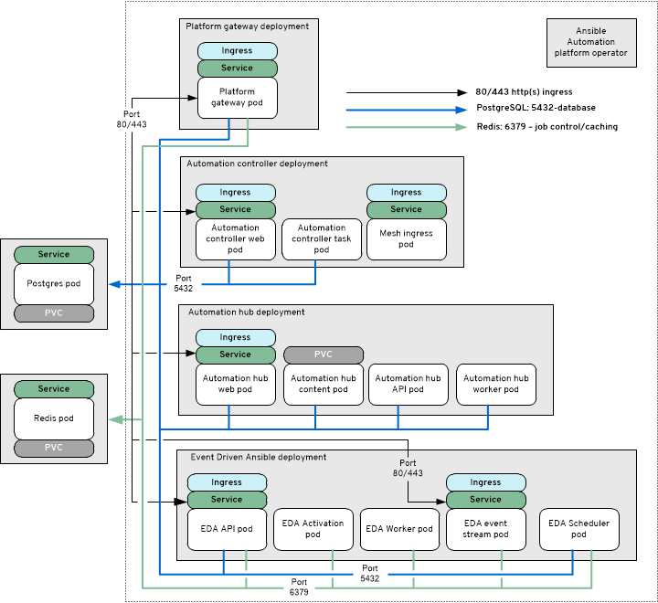

# OCP-A.ENV-A - Growth Topology - OpenShift - AAP Operator Install Method

## OpenShift - AAP Operator Install - OCP A
_SaaS Deployment used to represent ocp "growth" deployment_

## Topology

## Description

The **OpenShift - AAP Operator Install** model consists of the following:

| Component                                     | Pod count                      |
| --------------------------------------------- | ------------------------------ |
| AAP Gateway 2.5                               | 1                              |
| Automation Controller 2.5                     | 2 *(task, web)*                |
| Automation Hub 2.5                            | 4 *(api, content, web, worker)* |
| Event Driven Ansible 2.5                      | 5 *(api, activation, stream, scheduler,worker)* |
| Database                                      | 1                              |
| Redis Cache (non-HA)                          | 1                              |

