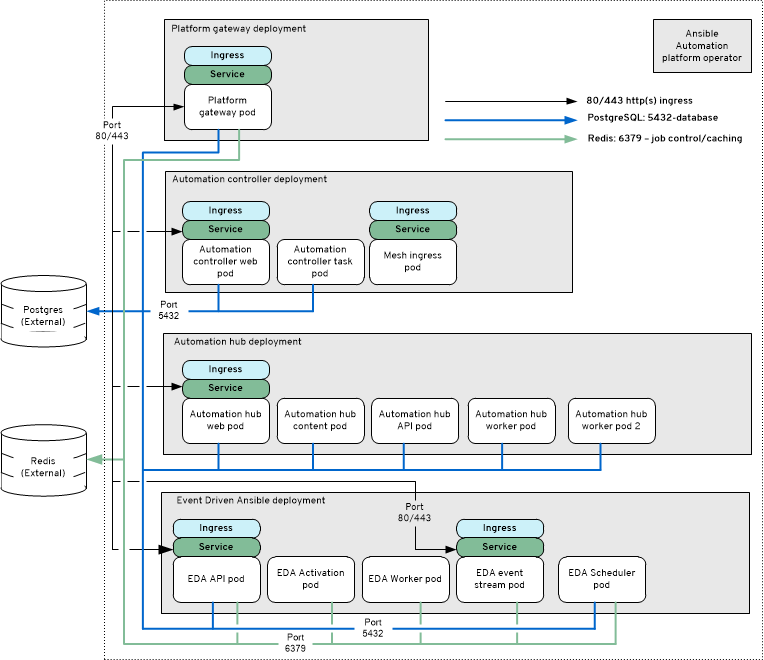

# OCP-B.ENV-A - Enterprise Deployment

## Enterprise OpenShift - OCP B
_SaaS Deployment used to represent ocp "enterprise" deployment_

## Topology

## Description

The **Enterprise OpenShift - AAP Operator Install** model consists of the following:

| Component                                     | Pod count                      |
| --------------------------------------------- | ------------------------------ |
| AAP Gateway 2.5                               | 1                              |
| Automation Controller 2.5                     | 2 *(task, web)*                |
| Automation Hub 2.5                            | 5 *(api, content, web, 2 workers)* |
| Event Driven Ansible 2.5                      | 5 *(api, activation, stream, scheduler,worker)* |
| Database (external)                           | 1                              |
| Redis Cache (external non-HA)                 | 1                              |

## Deployment (CR examples)

This directory contains AAP 2.5 CRs for deployment in AWS OCP (ROSA).

To deploy:

Fill in the following files after pre-creating all necessary resources:
 - kustomize/ansible-automation-platform/custom-resource/secrets-job-pull-secret.env
 - kustomize/ansible-automation-platform/custom-resource/secrets-controller-admin-pass.env
 - kustomize/ansible-automation-platform/custom-resource/secrets-hub-admin-pass.env
 - kustomize/ansible-automation-platform/custom-resource/secrets-hub-postgres.env
 - kustomize/ansible-automation-platform/custom-resource/secrets-hub-s3.env
 - kustomize/ansible-automation-platform/custom-resource/secrets-platform-admin-pass.env
 - kustomize/ansible-automation-platform/custom-resource/secrets-platform-postgres.env
 - kustomize/ansible-automation-platform/custom-resource/secrets-platform-redis.env
 - kustomize/ansible-automation-platform/custom-resource/config.env
 - kustomize/ansible-automation-platform/rds-init-db-resource/secrets.env
 - kustomize/aws-load-balancer/custom-resource/config.env
 - kustomize/cert-manager/custom-resource/config.env

Deploy in this order, checking to ensure each is complete and ready before continuing:
 - oc apply -k kustomize/ansible-automation-platform/operator
 - oc apply -k kustomize/ansible-automation-platform/rds-init-db-resource
 - oc apply -k kustomize/ansible-automation-platform/custom-resource
 - oc apply -k kustomize/cert-manager/operator
 - oc apply -k kustomize/cert-manager/custom-resource
 - oc apply -k kustomize/aws-load-balancer/operator
 - oc apply -k kustomize/aws-load-balancer/custom-resource
