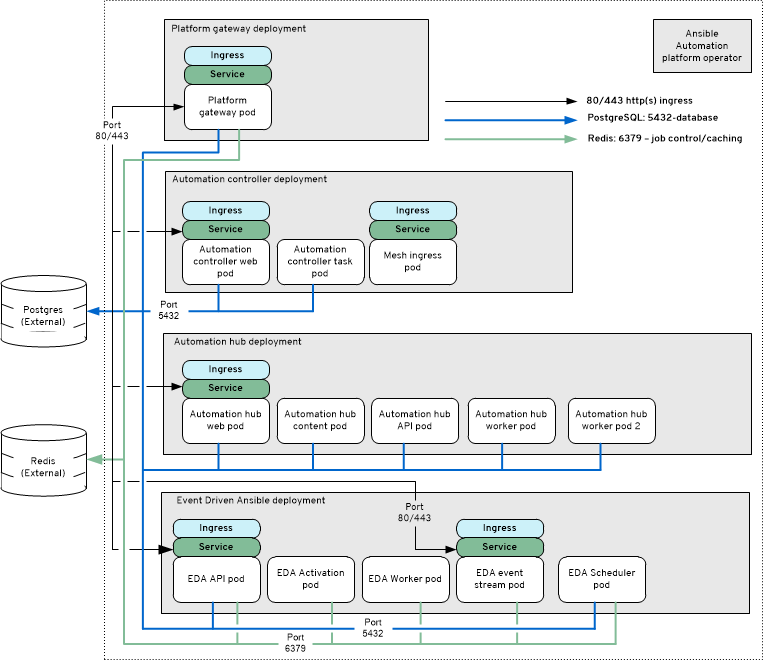

# OCP-B.ENV-A - Enterprise Deployment

## Enterprise OpenShift - OCP B

Deployment consists of a base level of replicas for Pods. Database, redis and storage
services are provided by external services.

## Topology

## Description

The **Enterprise OpenShift - AAP Operator Install** model consists of the following:

| Component                                     | Pod count                                       |
| --------------------------------------------- | ----------------------------------------------- |
| AAP Gateway 2.5                               | 1                                               |
| Automation Controller 2.5                     | 2 *(task, web)*                                 |
| Automation Hub 2.5                            | 5 *(api, content, web, 2 workers)*              |
| Event Driven Ansible 2.5                      | 5 *(api, activation, stream, scheduler,worker)* |
| Mesh Ingress                                  | 1                                               |

| External Components                           | Count                                           |
| --------------------------------------------- | ----------------------------------------------- |
| Database (external)                           | 1                                               |
| Redis Cache (external non-HA)                 | 1                                               |
| AWS S3 (example hub storage)                  | 1                                               |

## Deployment Guide

The platform is controled by an AnsibleAutomationPlatform custom resource found in (automation-platform.yaml)

The secrets for the database and redis should be created before AnsibleAutomationPlatform resource is
applied to the cluster.

Example database secret is found in (automation-platform-postgres-configuration.yaml).
Example redis secret is found in (automation-platform-redis-configuration.yaml).

The secrets are example templates and need to be cloned and modified to produce the appropriate number of
secrets for a proper installation.

Automation hub has support for a variety of storage backends for exeuction environments and collections.
Example storage secret is found in (automation-hub-storage.yaml).

A single mesh ingress node is configured by the custom resource in (mesh-ingress.yaml).

Refer to the production documentation for full details on configuration options.
