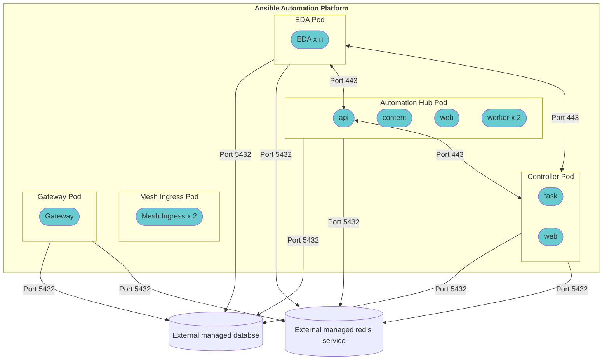
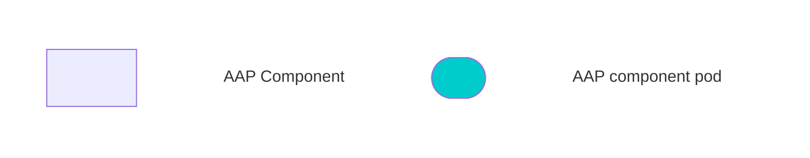

# OCP-B.ENV-A - Enterprise Deployment - OpenShift - AAP Operator Install Method

## Enterprise OpenShift - AAP Operator Install - OCP B
_SaaS Deployment used to represent ocp "enterprise" deployment_

## Topology

**Legend**

## Description

The **Enterprise OpenShift - AAP Operator Install** model consists of the following:

| Component                                     | Pod count                      |
| --------------------------------------------- | ------------------------------ |
| AAP Gateway                                   | 1                              |
| Automation Controller                         | 2 *(task, web)*                |
| Automation Hub                                | 5 *(api,content,web,2workers)* |
| Event Driven Ansible                          | x                              |
| Database (external)                           | 1                              |
| Redis Cache (non-HA)                          | 1                              |

