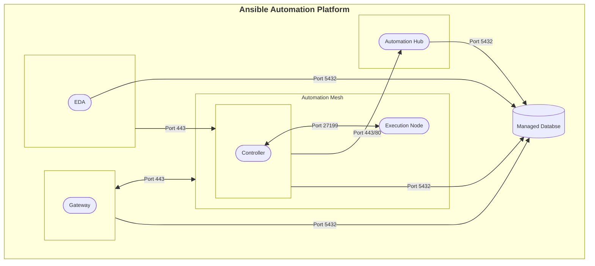
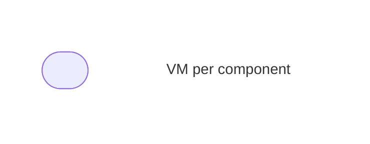

# RPM-A.ENV-B - Mixed Version RPM Deployment

## Mixed Version Single VM per AAP Component

## Topology

**_Legend:_**

## Description

The **Single VM per AAP Component** consists of the following:

| Component             | VM count |
| --------------------- | -------- |
| AAP Gateway 2.5           | 1        |
| Automation Controller 2.4 | 1        |
| Hop Node (optional)   | 1        |
| Automation Hub 2.4        | 1        |
| Event Driven Ansible 2.5  | 1        |
| Database (external)   | 1        |
| Redis Cache (non-HA)  | 1        |
