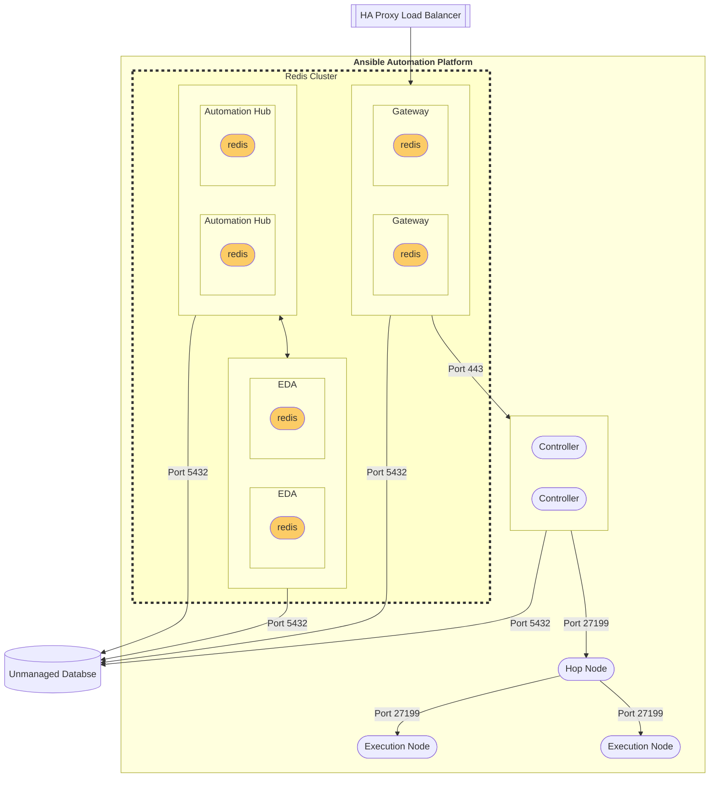

# Enterprise VM installer - RPM B

## Topology



**Legend**


## Description

The **Enterprise VM Installer RPM** consists of the following:

| Component                                     | VM count |
| --------------------------------------------- | -------- |
| AAP Gateway                                   | 2        |
| Automation Controller                         | 2        |
| Hop Node                                      | 1        |
| Execution Node                                | 2        |
| Automation Hub                                | 2        |
| Event Driven Ansible                          | 2        |
| Database (external)                           | 1        |
| Redis Cache (non-HA)                          | 1        |
| HAProxy load balancer in front of AAP Gateway | 1        |


## Inventory

```

[automationcontroller]
automationcontroller-0.testing.com ansible_user=ec2-user ansible_python_interpreter="/usr/libexec/platform-python" ansible_host=<<replace with controller vm1 ip>>
automationcontroller-1.testing.com ansible_user=ec2-user ansible_python_interpreter="/usr/libexec/platform-python" ansible_host=<<replace with controller vm2 ip>>

[automationedacontroller]
automationedacontroller-0.testing.com ansible_user=ec2-user ansible_python_interpreter="/usr/libexec/platform-python" ansible_host=<<replace with eda controller vm1 ip>> routable_hostname=automationedacontroller-0.testing.com eda_node_type=api eda_type=api
automationedacontroller-1.testing.com ansible_user=ec2-user ansible_python_interpreter="/usr/libexec/platform-python" ansible_host=<<replace with eda controller vm2 ip>> routable_hostname=automationedacontroller-1.testing.com eda_node_type=worker eda_type=worker

[automationhub]
automationhub-0.testing.com ansible_user=ec2-user ansible_python_interpreter="/usr/libexec/platform-python" ansible_host=<<replace with automation hub vm1 ip>> routable_hostname=automationhub-0.testing.com
automationhub-1.testing.com ansible_user=ec2-user ansible_python_interpreter="/usr/libexec/platform-python" ansible_host=<<replace with automation hub vm2 ip>> routable_hostname=automationhub-1.testing.com

[automationgateway]
automationgateway-0.testing.com ansible_user=ec2-user ansible_python_interpreter="/usr/libexec/platform-python" ansible_host=<<replace with gateway vm1 ip>> routable_hostname=automationgateway-0.testing.com
automationgateway-1.testing.com ansible_user=ec2-user ansible_python_interpreter="/usr/libexec/platform-python" ansible_host=<<replace with gateway vm2 ip>> routable_hostname=automationgateway-1.testing.com

[hop_nodes]
hop_node-0.testing.com ansible_user=ec2-user ansible_python_interpreter="/usr/libexec/platform-python" ansible_host=<<replace with hop node ip>> routable_hostname=hop_node-0.testing.com node_type=hop peers=automationcontroller

[execution_nodes]
execution_node-0.testing.com ansible_user=ec2-user ansible_python_interpreter="/usr/libexec/platform-python" ansible_host=<<replace with execution node1 ip>> routable_hostname=execution_node-0.testing.com peers=hop_node-0.testing.com node_type=execution
execution_node-1.testing.com ansible_user=ec2-user ansible_python_interpreter="/usr/libexec/platform-python" ansible_host=<<replace with execution node2 ip>> routable_hostname=execution_node-1.testing.com peers=hop_node-0.testing.com node_type=execution


[installer]
installer_machine ansible_connection=local ansible_python_interpreter="/usr/libexec/platform-python"


[external_database]
external_database-0.testing.com ansible_user=ec2-user ansible_python_interpreter="/usr/libexec/platform-python" ansible_host=<<replace with db ip>> routable_hostname=external_database-0.testing.com

[all:vars]
pg_host=external_database-0.testing.com
pg_port=5432
pg_database=awx
pg_username=awx
admin_password=<<admin password>>
pg_password=<<pg password>>
controller_base_url=https://<<controller ip>>/
hub_base_url=https://automationhub-0.testing.com/
gateway_base_url=https://<<gateway ip>>/
automationedacontroller_base_url=https://<<eda ip>>/
required_ram=0
automationhub_pg_host=external_database-0.testing.com
automationhub_pg_port=5432
automationhub_pg_database=automationhub
automationhub_pg_username=automationhub
automationhub_admin_password=<<automation hub admin password>>
automationhub_pg_password=<<automation hub pg password>>
automationedacontroller_pg_host=external_database-0.testing.com
automationedacontroller_pg_port=5432
automationedacontroller_pg_database=automationedacontroller
automationedacontroller_pg_username=automationedacontroller
automationedacontroller_allowed_hostnames=['<<eda controller ip>>']
automationedacontroller_admin_password=<<eda controller admin password>>
automationedacontroller_pg_password=<<eda controller pg password>>
automationgateway_pg_host=external_database-0.testing.com
automationgateway_pg_port=5432
automationgateway_pg_database=gateway
automationgateway_pg_username=gateway
automationgateway_admin_password=<<gateway admin password>>
automationgateway_pg_password=<<gateway admin password>>
automationhub_create_default_collection_signing_service=True
automationhub_require_content_approval=True
automationhub_auto_sign_collections=True
automationhub_collection_signing_service_key=/tmp/setup/ahub_content_signing.gpg
automationhub_collection_signing_service_script=/tmp/setup/ahub_content_signing_script
automationhub_create_default_container_signing_service=True
automationhub_container_signing_service_key=/tmp/setup/ahub_content_signing.gpg
automationhub_container_signing_service_script=/tmp/setup/ahub_container_signing_script

[automationcontroller:vars]
receptor_listener=True
receptor_listener_protocol=tcp
receptor_log_level=info
node_type=control

[automationgateway:vars]
automationgateway_grpc_server_processes=20
automationgateway_grpc_server_max_threads_per_process=40
automationgateway_grpc_auth_service_timeout=120s

[hop_nodes:vars]
peers=automationcontroller

[execution_nodes:vars]
receptor_listener=True
receptor_listener_protocol=tcp
receptor_log_level=info

```
