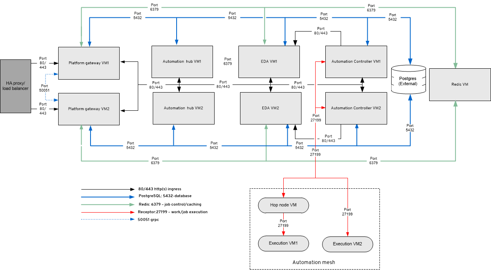

# RPM-B.ENV-A - Enterprise RPM Deployment

## Enterprise VM installer - RPM B

## Topology

## Description

The **Enterprise VM Installer RPM** consists of the following:

| Component                                     | VM count |
| --------------------------------------------- | -------- |
| AAP Gateway 2.5                               | 2        |
| Automation Controller 2.5                     | 2        |
| Hop Node                                      | 1        |
| Execution Node                                | 2        |
| Automation Hub 2.5                            | 2        |
| Event Driven Ansible 2.5                      | 2        |
| Database (external)                           | 1        |
| Redis Cache (non-HA)                          | 1        |
| HAProxy load balancer in front of AAP Gateway | 1        |
